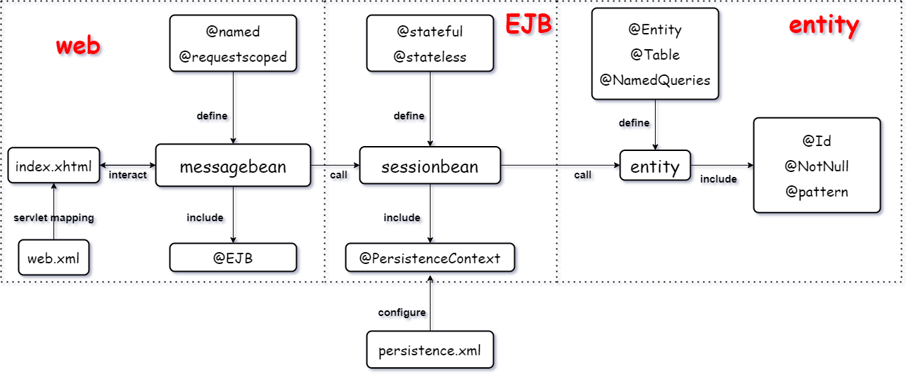
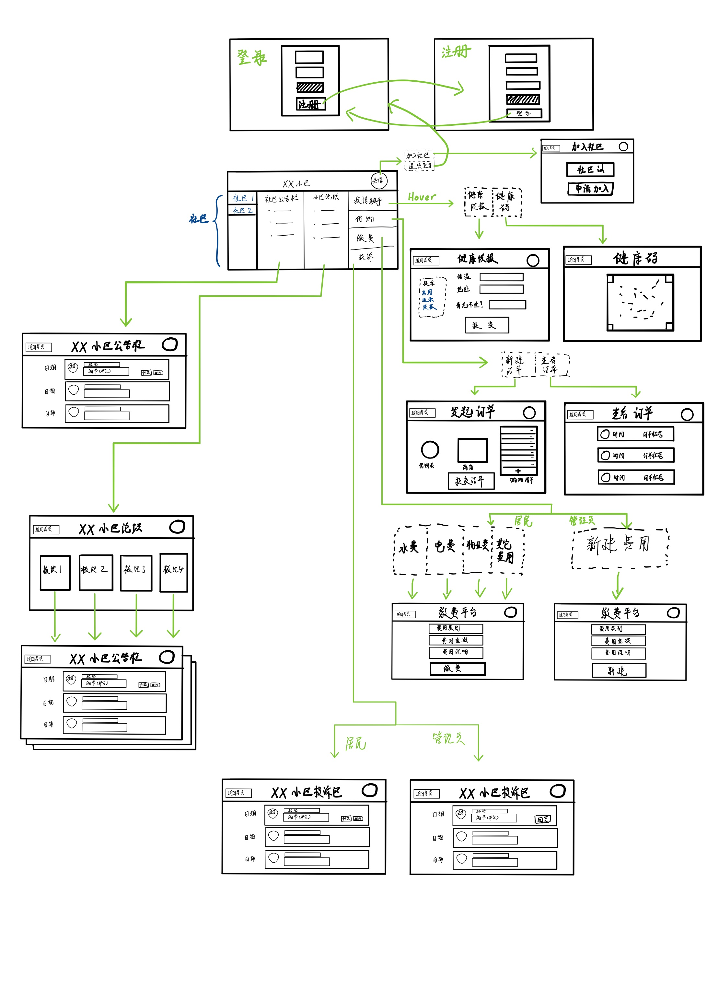

java-ee-project:

前端: 

后端:
<kbd>
    
    
    
</kbd>

<!-- TOC -->

- [开发文档](#%E5%BC%80%E5%8F%91%E6%96%87%E6%A1%A3)
    - [项目结构](#%E9%A1%B9%E7%9B%AE%E7%BB%93%E6%9E%84)
        - [需求文档](#%E9%9C%80%E6%B1%82%E6%96%87%E6%A1%A3)
        - [代码结构](#%E4%BB%A3%E7%A0%81%E7%BB%93%E6%9E%84)
        - [项目架构](#%E9%A1%B9%E7%9B%AE%E6%9E%B6%E6%9E%84)
    - [项目建模](#%E9%A1%B9%E7%9B%AE%E5%BB%BA%E6%A8%A1)
        - [前端](#%E5%89%8D%E7%AB%AF)
            - [前端原型设计](#%E5%89%8D%E7%AB%AF%E5%8E%9F%E5%9E%8B%E8%AE%BE%E8%AE%A1)
        - [数据库](#%E6%95%B0%E6%8D%AE%E5%BA%93)
            - [数据库接口](#%E6%95%B0%E6%8D%AE%E5%BA%93%E6%8E%A5%E5%8F%A3)
            - [数据库文档](#%E6%95%B0%E6%8D%AE%E5%BA%93%E6%96%87%E6%A1%A3)
        - [路由url](#%E8%B7%AF%E7%94%B1url)
        - [项目配置](#%E9%A1%B9%E7%9B%AE%E9%85%8D%E7%BD%AE)
- [参考文档](#%E5%8F%82%E8%80%83%E6%96%87%E6%A1%A3)
- [开发日志](#%E5%BC%80%E5%8F%91%E6%97%A5%E5%BF%97)

<!-- /TOC -->

## 开发文档

#### 项目结构

###### 需求文档

[需求文档](doc/tutorial/需求分析.md)

[wiki](https://github.com/ppdog0/java-ee-project/wiki/Requirements-Analysis)

###### 代码结构

    root:project
    |--.gitignore
    |--.iml
    |--pom.xml
    |--README.md
    |--doc:文档
    |   |--images
    |   |--tutorial:整理文档
    |--src:源文件
    |   |--main
    |   |    |--java:源文件
    |   |    |   |--web:业务逻辑
    |   |    |   |--ejb:数据库操作
    |   |    |   |--entity:实体
    |   |    |--resources:资源文件
    |   |    |   |--META-INF
    |   |    |   |   |--beans.xml
    |   |    |   |   |--persistence.xml:数据库配置
    |   |    |--webapp:web应用
    |   |    |   |--resources
    |   |    |   |--WEB-INF
    |   |    |   |   |--web.xml:web应用配置
    |   |    |   |   |--face-config.xml:JSF配置
    |   |    |   |--index.xhtml
    |   |--test.ejb.test:测试文件
    |--target:目标文件

###### 项目架构

#### 项目建模

##### 前端

###### 前端原型设计

##### 数据库

###### 数据库接口
[数据库接口](doc/model/database_interface.md)

###### 数据库文档

[数据库文档](doc/model/model.md)

##### 路由url

[API文档](doc/servlet/java_API.md)

###### 项目配置

`web.xml web`应用配置

`persistence.xml` 数据库配置

`glassfish-{web/resources}.xml` 服务器资源配置

`faces-config.xml` JSF配置

#### 参考文档

官方文档: [jakarta-tutorial](https://javaee.github.io/tutorial/toc.html)

整理文档: [整理文档](./doc/tutorial)

JSF文档: [JSF文档](https://www.w3cschool.cn/java/inject-managed-beans.html)
[验证器](https://blog.csdn.net/qq_33429968/article/details/73928719)
[JSF分离](https://blog.csdn.net/fish_your_god/article/details/100566216)

web文档:[跨域访问](https://blog.csdn.net/Wen__Fei/article/details/101458322)
[JS跨域访问](https://www.zhihu.com/question/26376773)
[servlet](https://www.zhihu.com/question/26376773)

#### 开发日志

- 09/06/2020

分析项目[需求文档](doc/tutorial/需求分析.md)，完成[项目架构](#%E9%A1%B9%E7%9B%AE%E6%9E%B6%E6%9E%84)、[数据库建模](#%E6%95%B0%E6%8D%AE%E5%BA%93%E5%BB%BA%E6%A8%A1)、[前端原型](https://dywioe.axshare.com)，更新整理文档: [整理文档](./doc/tutorial)、[wiki](https://github.com/ppdog0/java-ee-project/wiki/Requirements-Analysis)

- 09/07/2020

完成[数据库接口](doc/model/database_interface.md)，更新整理文档: [整理文档](./doc/tutorial)，完成entity和EJB的编写

- 09/08/2020

开始WEB开发
