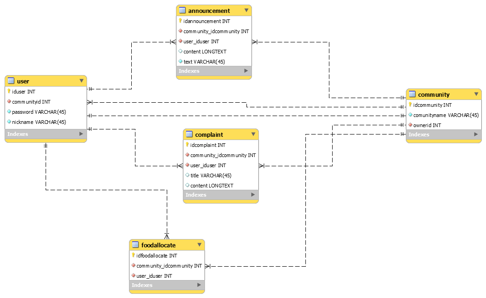

<!-- vscode-markdown-toc -->
		* 1. [项目结构](#)
		* 2. [项目建模](#-1)
		* 3. [参考文档](#-1)
		* 4. [开发日志](#-1)

<!-- vscode-markdown-toc-config
	numbering=true
	autoSave=true
	/vscode-markdown-toc-config -->
<!-- /vscode-markdown-toc -->java-ee-project: 前端: 后端:

####  1. 项目结构

###### 需求文档

[需求文档](doc/tutorial/需求分析.md)

###### 代码结构

    root:project
    |--.gitignore
    |--.iml
    |--pom.xml
    |--README.md
    |--doc:文档
    |   |--images
    |   |--tutorial:整理文档
    |--src:源文件
    |   |--main
    |   |    |--java:源文件
    |   |    |   |--web:业务逻辑
    |   |    |   |--ejb:数据库操作
    |   |    |   |--entity:实体
    |   |    |--resources:资源文件
    |   |    |   |--META-INF
    |   |    |   |   |--beans.xml
    |   |    |   |   |--persistence.xml:数据库配置
    |   |    |--webapp:web应用
    |   |    |   |--resources
    |   |    |   |--WEB-INF
    |   |    |   |   |--web.xml:web应用配置
    |   |    |   |   |--face-config.xml:JSF配置
    |   |    |   |--index.xhtml
    |   |--test:测试文件
    |--target:目标文件

###### 项目架构

####  2. 项目建模

##### 前端

###### 前端原型设计

[前端原型]()

##### 数据库

###### 数据库说明

[文档](doc/model/model.md)

###### 数据库建模

###### 项目配置

`web.xml web`应用配置

`persistence.xml` 数据库配置

`glassfish-{web/resources}.xml` 服务器资源配置

`faces-config.xml` JSF配置

####  3. 参考文档

[jakarta-tutorial](https://javaee.github.io/tutorial/toc.html)

[整理文档](./doc/tutorial)

[JSF文档](https://www.w3cschool.cn/java/inject-managed-beans.html)

####  4. 开发日志

-   09/06/2020

分析项目需求，完成项目架构、数据库建模、前端原型
